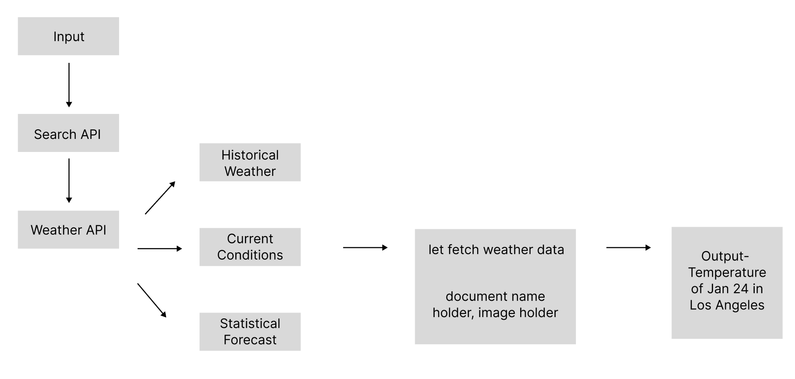

<html lang="en">
<head>
    <meta charset="UTF-8">
    <meta name="viewport" content="width=device-width, initial-scale=1.0">
   Project 2: Synthetic Relationships
</head>
<body>
    <h1> A gets interpretation of color while B gets distance </h1>
    

    
</body>
    https://youtu.be/iJR7IlB6teQ
    A and B are in the same environment. Here are the processes of the information transformation from A & B sides.

A to B: A with RGB sensor is watching “Wheel of Fortune” (Colors are always changing in the screen). A gets interpretation of “color,” sends to cloud. A sees and interacts with the world through color and light. B receives “color,” use that to turn servo. Spin the wheel!

B to A: B with the Ultrasonic sensor gets interpretation of “distance,” send to cloud. B sees and interacts with the world through distance and movement. A receives the “distance” information, then use that to turn on light.

They will be able to transmit and receive information at the same time. Their communication is always going to be perceptible by the outsiders.
</html>
